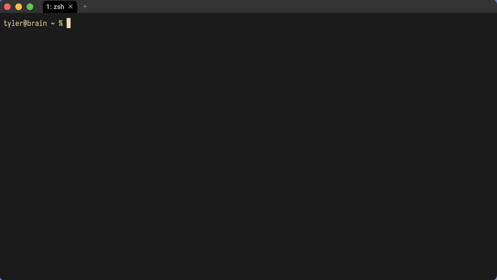
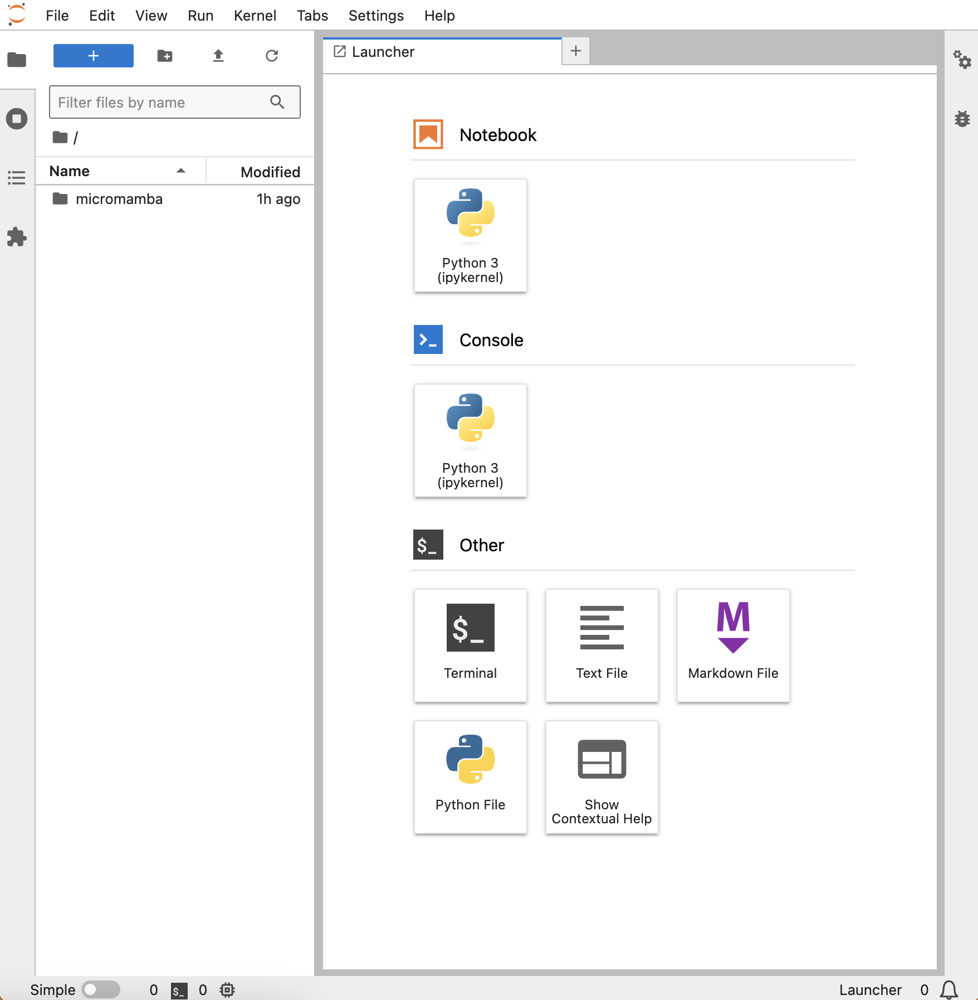

---
jupytext:
  formats: md:myst
  text_representation:
    extension: .md
    format_name: myst
kernelspec:
  display_name: Python 3
  language: python
  name: python3
---

Getting Started
===============

This chapter introduces fundamental concepts for working with code. We begin
with the Unix command line and environment management, after which we will turn
to an overview of the Python programming language.

+ **Prerequisites:** if you are using Windows, install [Git
for Windows][git]. It comes with Git Bash, a Unix-style command-line interface.

[git]: https://git-scm.com/downloads


## Command Line Basics

Most modern coding platforms follow the conventions of mainstream computing,
using a **graphical user interface** (GUI) to display information and accept
user input. But there is still real value in knowing the basics of the
**command-line interface** (CLI), which relies solely on text input. Learning
how to use the CLI will teach you a great deal about how your computer works,
and there are still several instances where CLIs are the only point of access
to a system.

The CLI contains three main parts:

1. A **terminal**: an environment you use to send/receive information to/from
   your computer
2. A **shell**: a program that executes commands you enter into the terminal
3. The **command line**: where you enter the commands that the shell executes

As we move through this chapter, keep one key thing in mind: a CLI is just
another mode of interaction with your computer. Everything you can access
through a windowing system on a GUI is also accessible with a CLI.


### Launching a command-line interface

MacOS comes with a pre-installed CLI called Terminal. To launch it, go to:

```
Applications -> Utilities -> Terminal
```

Windows users will use Git Bash. To launch it, do the following:

```
Windows Start Menu -> search "Git Bash"
```

Or:

```
Windows Start Menu -> Programs -> Git Bash
```

You should see something like this when your CLI launches:



The window above shows a basic command line with a **prompt**. A prompt is an
input field where you type your commands, and it is prepended with useful
information about your computer:

+ First, `tyler@brain` tells us the current user (`tyler`) and the current 
  computer (`brain`). That may seem like redundant information, but with the
  command line it's possible to log in to other computers
+ The prompt also tells us where we are on this computer's file system. Right
  now we are at `~`. We'll discuss what this symbol means later. For now, just
  keep in mind that this is where you should look to get your bearings
+ Finally, we see `%`. It is an indicator that the CLI is waiting for input

:::{tip}
In the following sections, we will display CLI commands by prepending them with
an indicator character, `$`. You do not need to type this character yourself,
it's just to signal that a cell shows a command.
:::


### Input and interactions

Time to enter some commands. This is simply a matter of typing them in after
the prompt and pressing `Return`/`Enter`.

For example, `echo` will print back to screen any text that you supply the
command:

```sh
$ echo "Hello world!"
```
```
Hello world!
```

You can see what files and folders are in your current location with `ls`
("list"):

```sh
$ ls
```
```
_build      _config.yml _toc.yml    chapters    data        env         img         scratch     src
```

Send `ls` the name of a subfolder to show its contents:

```sh
$ ls chapters
```
```
01_getting-started.md      04_ngram-models.md         07_intro-to-llms.md        index.md
02_python-basics.md        05_vectorization.md        08_bert.md
03_data-analysis-basics.md 06_vector-spaces.md        09_gpt.md
```

Want more information? Modify the base functionality of `ls`---or any
command---with **flags**. We do this by adding a dash `-` and then a letter, or
a combination of letters, directly after the dash. Below, we send `ls` flags to
have it show all contents (`a`) with long-formatted output (`l`) in a
human-readable fashion (`h`):

```sh
$ ls -alh
```
```
drwxr-xr-x  13 <username>  staff   416B May 25 01:46 .
drwxr-xr-x   5 <username>  staff   160B May  8 12:58 ..
drwxr-xr-x  14 <username>  staff   448B May 25 01:35 .git
-rw-r--r--   1 <username>  staff    20B Apr 22 15:44 .gitignore
drwxr-xr-x   6 <username>  staff   192B Apr 25 22:01 _build
-rw-r--r--   1 <username>  staff   501B Apr 21 23:23 _config.yml
-rw-r--r--   1 <username>  staff   583B Apr 22 10:10 _toc.yml
drwxr-xr-x  12 <username>  staff   384B May 30 13:00 chapters
drwxr-xr-x  11 <username>  staff   352B May 17 17:16 data
drwxr-xr-x   5 <username>  staff   160B May 30 12:37 img
drwxr-xr-x   5 <username>  staff   160B May 25 01:35 src
```

Long-formatted output shows you metadata about files and folders, including
information about the their owner/group (`<username>` and `staff`), their
permissions (those strings of `r`'s, `w`'s, and `x`'s), their size, and the
last date they were modified. We won't discuss permissions in depth, but know
that they dictate who can read `r`, write `w`, and execute `x` files.

Any file or folder prepended with `.` in its name will be hidden by default on
your computer. But using the all `-a` flag, as we did above, will show them:
`.`, `..`, `.git`, and `.gitignore`. The first two are special notations for
navigating your computer, which we discuss in the next section. The third,
`.git`, is a subfolder that stores version control information about this
reader, and `.gitignore` is a **dotfile**. Dotfiles often contain various
configuration settings that people use to customize their computers. In this
case, `.gitignore` controls what parts of this folder version control should
ignore.


### Command-line syntax

Depending on your computer and CLI, the above output may differ slightly, but
in general the basic presentation and functionality will be the same. Commands
use a space to delimit their different components, and flags are called with
`-` to modify those commands. When put together, we can generalize these
components to a command-line **syntax**:

```sh
$ <command> <optional flags> <file/data on which to run the command>
```

One caveat: since spaces are a meaningful part of the command-line syntax, file
names with spaces in them can cause problems. You'll need to **escape** these
names with `\`.

This will throw an error:

```sh
$ <command> file name.txt
```

But this will not:

```sh
$ <command> file\ name.txt
```

Be sure to read error messages when you see them. While the CLI is often quite
mute, it will do its best to show you what you did wrong when an error arises.
Below, for example, the shell explains that it cannot find a command, which
actually stems from a typing error:

```sh
$ lschapters
```
```
zsh: command not found: lschapters
```

Likewise, here, `ls` cannot find the requested folder because it does not
exist:

```sh
$ ls storage
```
```
ls: storage: No such file or directory
```

One last thing about general CLI usage. Sometimes, you need to stop a process
immediately. Use `CTRL+C` to **interrupt** it. But keep in mind that, for the
most part, it isn't possible to undo a command. Take care to know exactly what
you're running and what you're running it on, especially as you get acclimated
to the CLI.


### Getting help

There are dozens of commands available to you on your computer, and you can
install even more. If you'd like to see an overview of some of the most common
commands, take a look at Valerie Summet's [Unix cheat sheet][sheet].

[sheet]: https://geog-464.github.io/unix_cheatsheet.html

You can also use `man` ("manual"). This opens the **manual page** for another
command. Here you will find usage information, including what flags a command
accepts. 

```sh
$ man ls
```
```
LS(1)                                            General Commands Manual                                            LS(1)

NAME
     ls – list directory contents

SYNOPSIS
     ls [-@ABCFGHILOPRSTUWabcdefghiklmnopqrstuvwxy1%,] [--color=when] [-D format] [file ...]

DESCRIPTION
     For each operand that names a file of a type other than directory, ls displays its name as well as any requested,
     associated information.  For each operand that names a file of type directory, ls displays the names of files
     contained within that directory, as well as any requested, associated information.

     If no operands are given, the contents of the current directory are displayed.  If more than one operand is given,
     non-directory operands are displayed first; directory and non-directory operands are sorted separately and in
     lexicographical order.

     The following options are available:

<...>
```

A shortened version of this output is often available by flagging a command
with `--help`. Sometimes, too, you will need to know the version of the command
you're using. You can find this information with `--version`, or `--v`.


## Directory Structures

Remember that a CLI is just another mode of interaction with your computer.
This section will solidify that idea by showing you how to navigate your
computer's **directory structure**, the arrangement and organization of its
data.


### Paths

A directory structure is like a map of all the locations you can navigate on
your computer. These locations are **directories** (or folders), and within
them are **files** (chunks of data). Each file has an **address** on this map,
and there is a **path** that leads to it. The windowing systems of modern
computers manage these paths automatically when you click around on your
computer, but it's also possible to navigate on the command line. You'll just
need to specify paths yourself.

In a Unix environment, we do this with the following syntax:

```sh
/this/is/a/path/to/your/file.txt
```

This is called a **file path**. It threads through multiple directories to
point at your desired file, `file.txt`.

:::{note}
Non-Unix environments, like Windows DOS, use `\` instead of `/`:

```sh
C:\this\is\a\path\to\your\file.txt
```

This is why Windows users had to download Git Bash. It emulates Unix-style
functionality on those machines. Generally speaking, the Unix command line is
far more pervasive than DOS, so you'll find yourself using Unix-style
commands/syntax more frequently.
:::


### Path hierarchies

A directory structure is **hierarchical**. Directories are "above" or "below"
one another, and it's crucial to get a sense of this so that you can navigate
your computer. In the file path above, every `/` demarcates a new one of these
directory levels.

Use `pwd` ("print working directory") to display your current location using
the same format:

```sh
$ pwd
```
```
/Users/tyler/2024_dtl_llm-interpretability
```

Note that this path begins with `/`. This is the top-most directory in your
computer, called the **root**. It's like the trunk of a tree: every directory
branches off from it. But, to add some complications, directories can also
branch off one another. Whenever you make a new directory, you've created
another branch in this tree, and this branch is at the same time a branch of
root and a branch of whatever directory you're currently in.

For example, here is the structure of this reader's `data` directory:

```
data
├── bert_blurb_classifier
│   └── final
├── dickinson_poetry-foundation-poems
│   └── poems
├── james_corpus
│   ├── chapterize
│   │   └── chapterize
│   ├── chapterized
│   │   ├── 1871-watch-and-ward
│   │   ├── 1875-roderick-hudson
│   │   ├── 1877-the-american
│   │   ├── 1878-the-europeans
│   │   ├── 1879-confidence
│   │   ├── 1880-washington-square
│   │   ├── 1881-portrait-of-a-lady
│   │   ├── 1886-bostonians
│   │   ├── 1886-princess-casamassima
│   │   ├── 1888-reverberator
│   │   ├── 1890-tragic-muse
│   │   ├── 1897-spoils-poynton
│   │   ├── 1897-what-maisie-knew
│   │   ├── 1899-awkward-age
│   │   ├── 1901-sacred-found
│   │   ├── 1902-wings-of-the-dove
│   │   ├── 1903-ambassadors
│   │   ├── 1904-golden-bowl
│   │   ├── 1911-outcry
│   │   └── 1917-ivory-tower
│   └── raw
├── nyt_obituaries
│   └── texts
└── saussure
```

See all the branching paths?

:::{note}
DOS again diverges from Unix in its representation of the root. For the former,
the root is usually called `C:` or `D:`, which designates the actual device on
which your data is stored.
:::


### Absolute vs. relative paths

No matter the operating system, there are two different ways to specify a file
path on the command line. Recall our `pwd` output above:

```sh
$ pwd
```
```
/Users/tyler/2024_dtl_llm-interpretability
```

It starts with root `/`. When you see a path like this, it's showing you the
full, or **absolute**, location of a directory or file. By typing out this
path, you can navigate directly to this location, regardless of where you are
on your computer.

By contrast, a **relative** path is context-specific. It depends on where you
are in your computer's directory structure. Unix uses shorthand to denote this
location:

+ `.` denotes the current location in your computer
+ `..` denotes the directory above that location

Remember seeing these earlier with `ls -alh`? Your computer tracks locations by
placing these two symbols in every directory you create. Thus, this enables you
to use this shorthand notation to avoid typing out the entire path to a file.
This is useful if you're a ways off from root, or if, for a coding project, you
are using files that rely on a specific directory structure, which could be
ported to someone else's computer.

Besides `.` and `..`, there is also `~`, which we saw in the CLI prompt
earlier. This denotes your **home directory**, which your computer uses to
store data and configurations that are specific to you. Use `cd` ("change
directory") in combination with `~` to return to home, no matter where you are
in your computer's directory structure.

```sh
$ cd ~
```

Take a look at your prompt: it should list out `~` in the location position.


### Navigating with a CLI

Here's an example of absolute and relative paths. Say you are here:

```
/here/is/where/you/are/located/in/your/computer
                                       ^^^^^^^^
```

...and you want to get to `located`:

```
/here/is/where/you/are/located/in/your/computer
                       ^^^^^^^
```

You could use an absolute path:

```sh
$ cd /here/is/where/you/are/located
```

The logic of this path runs like this:

```
root
└── here
│   └── is
│       └── where
│           └── you
│               └── are
└──────────────────>└── located
                        └── in
                            └── your
                                └── computer
```

Alternatively, you could use a relative path:

```sh
$ cd ../../../
```

In contrast with the absolute path, the logic of this relative one runs like
this:

```
root
└── here
    └── is
        └── where
            └── you
                └── are
                    └── located
                    ^   └── in
                    │       └── your
                    │           └── computer
                    └───────────────┘
```

Your relative path would take you three directories up from `computer` to
`located`. That's considerably shorter than writing the path out in full, but
there's also a downside: using multiple `..` symbols makes it hard to know what
the context of the path is, and it's easy to get confused. So, there's a
trade-off between absolute and relative paths, which you'll often find yourself
making.

Finally, we can move data and directories around on our computers using paths.
To move a file, use `mv` ("move"), which works like so:

```sh
$ mv <location/of/file> <location/where/you/want/to/move/the/file>
```

If we're in a directory that looks like this:

```sh
$ ls
```
```
file.txt  subdirectory
```

...and we'd like to move `file.txt` into `subdirectory`, we use:

```sh
$ mv file.txt subdirectory
```

Or, maybe we want to make a new directory inside `subdirectory`. Use `mkdir`
("make directory") to make a new directory, `new`, which will sit under
`subdirectory`.

```sh
$ mkdir subdirectory/new
```

Now, from our current location, we move `file.txt` into `new`.

```sh
$ mv subdirectory/file.txt subdirectory/new/file.txt
```

This is what the directory structure looks like now:

```sh
current_location
└── subdirectory
    └── new
        └── file.txt
```


## Environment Setup

Processes---applications, background tasks, code, etc.---run on your computer
in a **computer environment**. These environments are collections of hardware,
software, and various configurations, and the latter two are portable between
computers (ideally). This portability is great for when you get a new computer
and want to recreate your current environment, whether by replicating certain
settings or installing external software; but the real power of porting
environments stems from the ability to freeze them and share them with others.

You'll often have to do this when writing code, because some people may not
have certain pieces of software that you have on your computer. And, as we'll
discuss a little later on, writing code often relies on specific versions of
programming language packages, which can conflict with one another---and cause
massive headaches. Using an **environment manager** to encapsulate your setup
will help you circumvent such problems and let others run your code as you
intended.


### Micromamba

We will use [`micromamba`][micro] to manage environments for the work that lies
ahead. It allows us to create new **virtual environments** and install software
into them, including different versions of Python and associated packages.
`micromamba` is based on [`mamba`][mamba], which is in turn based on
[`conda`][conda]; the three are drop-in replacements for each another, so when
you see discussions about one, know that the topic will likely port over to the
others.

[micro]: https://mamba.readthedocs.io/en/latest/user_guide/micromamba.html
[mamba]: https://mamba.readthedocs.io/en/latest/user_guide/mamba.html
[conda]: https://docs.conda.io/en/latest/

The `micromamba` documentation (linked above) will always feature the most
recent version of installation instructions. As of this writing (summer 2024),
installing via the script option in a CLI works like so:

```sh
$ "${SHELL}" <(curl -L micro.mamba.pm/install.sh)
```

Running this command will download and install a script. During installation,
you'll be asked a series of questions:

+ `Micromamba binary folder? [~/.local/bin]`: Where do you want to install the
  program? Select the default by pressing `Enter`/`Return`
+ `Init shell (bash)? [Y/n]`: Configure your shell for `micromamba`? Enter `Y`
+ `Configure conda-forge? [Y/n]`: Default to the `conda-forge` repository when
  searching for packages to install? Enter `Y`
+ `Prefix location? [~/micromamba]`: Where would you like to install
  environments? The default is under your home directory, which is fine. Press
  `Enter`/`Return`

With these options set, reload your shell to initialize `micromamba`:

::::{tab-set}
:::{tab-item} zsh
```sh
$ source ~/.zshrc
```
:::
:::{tab-item} bash
```sh
$ source ~/.bashrc
```
:::
::::

:::{tip}
You don't need to run `source` to initialize `micromamba` every time you open
your CLI. Your CLI actually runs this command when on start up---we just have
the program running already.
:::

Now check the version of `micromamba`:

```sh
$ micromamba --version
```
```
1.5.8
```

If you see output like the above, you're set!

Time to create a new environment. Generally, it's a good idea to make a new
environment for every project. Below, we make one called `practice`.

```sh
$ micromamba create --name practice
```
```
Empty environment created at prefix: <path/to/practice>
```

Use the `env list` subcommand to list out all environments:

```sh
$ micromamba env list
```
```
  Name      Active  Path
──────────────────────────────────────────────────────────
  practice          <path/to/micromamba/envs/practice>
```

Activate an environment with the `activate <enviroment>` subcommand.

```sh
$ micromamba activate practice
```

Note your prompt. It will update to reflect that you're in a `micromamba`
environment:

```sh
(practice) you@your_computer ~$
```

Let's install some software. Below, we install [`ripgrep`][rg], which enables
you to search text files in a directory:

```sh
$ micromamba install ripgrep
```

[rg]: https://github.com/BurntSushi/ripgrep

When prompted, enter `Y` to confirm that you'd like to install the program.

Now, use `ripgrep` to search for "NLP" in `chapters`:

```sh
$ rg -i "NLP" chapters
```
```
chapters/02_python-basics.md
309:all repeated tokens. The result will be a set of in NLP are called **types**:

chapters/01_getting-started.md
666:Now, use `ripgrep` to search for "NLP" in `chapters`:
669:$ rg -i "NLP" chapters
673:648:  in the same direction as the first. Most vector operations in NLP use the
676:309:all repeated tokens. The result will be a set of in NLP are called **types**:
679:664:Now, use `ripgrep` to search for "NLP" in `chapters`:
680:667:$ rg -i "NLP" chapters
694:$ rg -i "NLP" chapters
863:machine learning/AI and natural language processing (NLP): most people are
1272:nlp = "natural language processing"
1273:nlp.title()
1279:nlp.count("g")
1294:dir(nlp)
1422:computing, NLP, and machine learning/AI. A full list of them is provided in the

chapters/05_vectorization.md
648:  in the same direction as the first. Most vector operations in NLP use the
```

See how it picked up the very text you're reading now?

Use the `deactivate` subcommand to deactivate an environment.

```sh
$ micromamba deactivate
```

Now, if you try to use `ripgrep`, you'll get an error:

```sh
$ rg -i "NLP" chapters
```
```
zsh: command not found: rg
```

Why the error? You've installed `ripgrep` into a separate environment managed
by `micromamba`, which is sealed off from the rest of your computer. 

To see all packages installed in an environment, use `list`:

```sh
$ micromamba activate practice
$ micromamba list
```
```
List of packages in environment: "<path/to/micromamba/envs/practice>"

  Name           Version  Build        Channel
────────────────────────────────────────────────────
  _libgcc_mutex  0.1      conda_forge  conda-forge
  _openmp_mutex  4.5      2_gnu        conda-forge
  libgcc-ng      13.2.0   h77fa898_7   conda-forge
  libgomp        13.2.0   h77fa898_7   conda-forge
  ripgrep        14.1.0   he8a937b_0   conda-forge
```

Why does this list have more than `ripgrep`? Those are the program's
**dependencies**, external pieces of software written and released by other
programmers that `ripgrep` uses to run. If you want to use `ripgrep`, you need
those as well, and it's `micromamba`'s job to figure out how to manage those
dependencies.

For example, `micromamba` will include them when you export your environment
with the `env export` subcommand:

```sh
$ micromamba env export
```
```
name: practice
channels:
- conda-forge
dependencies:
- _libgcc_mutex=0.1=conda_forge
- _openmp_mutex=4.5=2_gnu
- libgcc-ng=13.2.0=h77fa898_7
- libgomp=13.2.0=h77fa898_7
- ripgrep=14.1.0=he8a937b_0
```

Those letter and number combinations after each entry are specific versions,
which another person could use to recreate your current environment. That said,
sometimes operating system differences complicate versioning, so set the
`--from-history` flag to get only the names of the packages you've installed:

```sh
$ micromamba env export --from-history
```
```
name: practice
channels:
- conda-forge
dependencies:
- ripgrep
```

:::{note}
If you installed a package with a specific version, e.g.:

```sh
$ micromamba install ripgrep=12.1
```

...the `--from-history` flag will preserve this:

```sh
$ micromamba env export --from-history
```
```
name: practice
channels:
- conda-forge
dependencies:
- ripgrep=12.1
```
:::

Redirect the output of your environment export to a YAML file using `>`:

```sh
$ micromamba env export --from-history > practice.yml
```

And that way someone can install it on their own computer, using:

```sh
$ micromamba env create --file practice.yml
```

Finally, to remove an environment, deactivate it and run the following:

```sh
$ micromamba env remove --name practice
```


### Jupyter Lab

With an environment manager installed, we turn now to a development environment
for writing and running code. There are several applications to choose from; we
will use a simple, open-source environment called [JupyterLab][jl]. JupyterLab
runs in your web browser, it's highly portable and flexible, and it has an
integrated **notebook interface** for writing, documenting, recreating, and
running code. 

[jl]: https://jupyter.org/

Before we download JupyterLab, we'll create a new `micromamba` environment,
`main`. While it's a good idea to have project-specific virtual environments,
using a separate one to run JupyterLab and other such general programs will
keep you from re-installing the same software over and over.

```sh
$ micromamba env create --name main
```

Now, we install JupyterLab with `micromamba`.

```sh
$ micromamba activate main
$ micromamba install jupyterlab
```

To run the application, enter the following in your CLI:

```sh
$ jupyter lab
```

This will open a new tab in your web browser, where JupyterLab will be running:



At the left you'll see a file browser. In the Launcher, there are options to
launch coding interfaces (under both Notebook and Console), a terminal, or
various text files. To run code, JupyterLab uses **kernels**. Kernels are
associated with specific programming languages, and they allow users to write
code in an interactive way. We'll use a Python kernel, but you can also install
ones for R, Julia, and other languages.

It's also possible to create a kernel for a virtual environment. We'll do this
shortly. But for now, click on the default kernel, Python 3, under Notebook.
This will launch a **Jupyter notebook**. These files support code execution in
**cells**, text formatting via [Markdown][md], image rendering, and more. While
programmers typically write their code in plain text files, the interactivity
and formatting features of Jupyter notebooks make them highly useful for
developing and demonstrating code. That said, unlike plain text files, these
files must be rendered in a web browser by Jupyter. There's no easy way to see
their contents otherwise.

[md]: https://jupyter-notebook.readthedocs.io/en/stable/examples/Notebook/Working%20With%20Markdown%20Cells.html


## Writing Code in Python

We will be writing all of our code in Python. It's a massively popular,
general-purpose programming language with big communities of support. For our
purposes, most notable among these communities are the ones that support
machine learning/AI and natural language processing (NLP): most people are
using Python to write this kind of code. 

To write Python code in a notebook, click on a cell and type an **expression**.
Expressions are combinations of values, variables, operators, and functions,
which Python (and other programming languages) **interprets** and then
**evaluates**.

Here is a simple expression:

```py
2 + 2
```

Press `Shift` + `Enter` to run it:

```{code-cell}
2 + 2
```

Now, try subtraction:

```{code-cell}
7 - 1
```

You can write any arithmetic equation in Python using these and other
**operators**. These are symbols that represent common operations for
arithmetic, comparison, and logical evaluation. The table below records
Python's arithmetic operators.

| Operator | Meaning                     |
|----------|-----------------------------|
| `+`      | Addition                    |
| `-`      | Subtraction                 |
| `*`      | Multiplication              |
| `/`      | Division                    |
| `%`      | Remainder division (modulo) |
| `**`     | Exponentiation              |

Use parentheses `( )` to create more complicated expressions. Python will
evaluate these expressions in the standard order of operations: parentheses,
exponentiation, multiplication, division, addition, and then subtraction.

```{code-cell}
(2 + 2) * (7 - 1)
```

Technically, there's no need to add spaces between these expressions, but doing
so helps with readability.

```{code-cell}
(2+2)*(7-1)
```


### Variables

Below, we calculate the area of a triangle with base 2.5 and height 4:

```{code-cell}
2.5 * 4 * 0.5
```

If we wanted to store the result of this expression for later use, we'd need to
assign it to a **variable**. Create one by writing out the name of the variable
and using the assignment operator `=` to link the variable with an expression.

```{code-cell}
area = 2.5 * 4 * 0.5
```

Variables can be any combination of letters, numbers, or underscores `_`. They
cannot start with a number, however, and other symbols are not allowed in their
names. When you write code, you'll find yourself using variables all the time.
Not only do they store values; they also make your code more reusable and more
readable, and they help you generalize your code beyond specific values.

For example, we can create variables for `base` and `height` that allow us to
change `area` with ease:

```{code-cell}
base = 2.5
height = 4
area = base * height / 2
area
```

Want another value? Reassign the variable:

```{code-cell}
height = 5
area = base * height / 2
area
```

Good variable names are descriptive. While these are two perfectly valid
variables:

```{code-cell}
i8 = 4
_a = 5
```

It would be hard to track what they stand for when you go to use them:

```{code-cell}
result = (i8 ** 2 + _a ** 2) ** 0.5
result
```

Let's clarify:

```{code-cell}
leg_1 = 4
leg_2 = 5
hypotenuse = (leg_1 ** 2 + leg_2 ** 2) ** 0.5
hypotenuse
```

In both cases, we calculated the hypotenuse of a right-angled triangle
following the Pythagorean theorem, but the second expression makes this much
more clear.


### Strings

Python uses different **data types** to store certain kinds of values. We've
already used numeric types, but it's also possible to create strings and
logical values.

To create a string in Python, use either single `'` or double `"` quotes:

```{code-cell}
"I am a string"
```

Note that the quotes must match, or you'll cause an error:

```{code-cell}
:tags: [raises-exception]
"I am a string'
```

If you want to use quotations inside your string, you need to use a different
kind of quotation mark to enclose that string:

```{code-cell}
"I'm a string"
```

Or, you can **escape** the string with `\`. This tells Python to treat the
following symbol as if it were just a string, not a special character for the
language itself.

```{code-cell}
'I\'m a string'
```

Note that there is a difference between numeric values and strings that
represent values. That is, `1` does not equal `"1"`.


### Numbers

There are two kinds of numeric types In Python, **integers** and **floats**.
Integers are just whole numbers:

```{code-cell}
4
```

Whereas floats represent decimals:

```{code-cell}
8.8
```

When you perform arithmetic expressions in Python, the language will
automatically determine whether the result should be represented as an integer
or a float. Here's an integer result:

```{code-cell}
5 + 5
```

And a float:

```{code-cell}
1 / 3
```

Both numeric types may be either positive or negative. Use `-` to create a
negative number:

```{code-cell}
-4
```

Certain expressions will also produce negative numbers:

```{code-cell}
8 - 12
```


### Comparisons

You'll often need to compare values when you code. Use **comparison** operators
to do so:

| Operator | Meaning                  |
|----------|--------------------------|
| `<`      | Less than                |
| `>`      | Greater than             |
| `<=`     | Less than or equal to    |
| `>=`     | Greater than or equal to |
| `==`     | Equal to                 |
| `!=`     | Not equal to             |

Note that "equal to" uses two equal symbols to distinguish it from the
assignment operator `=`.

Comparisons return `True`/`False`, or **Boolean**, values. Here are a few:

```{code-cell}
-6 < 0
```

```{code-cell}
(5 + 5) != 9
```

```{code-cell}
1.4 >= 1.6
```

Note that comparisons will often work across types:

```{code-cell}
"1" == 1
```

Booleans are also assigned their own **keywords**:

```{code-cell}
True
```

And they may be compared as well:

```{code-cell}
False == True
```

### Conditionals

Python has other keywords besides Booleans. Keywords are predefined words that
have special meanings to the programming language. We'll see several of them,
and as you write in Python, you'll come to remember which ones to use. For
example, you'll often use **conditional statements** in your code to check the
state of your code perform a **branching** operation. We manage these with
special keywords.

Below, we use `if` to determine whether a comparison is true. If our code meets
this condition, we use the `print()` function to print `True`.

```{code-cell}
x = 5
y = 3
if x > y == True:
    print(True)
```

Importantly, if a comparison does not meet our condition, the code does
nothing.

```{code-cell}
y = 10
if x > y == True:
    print(True)
```

We would need to handle this second case ourselves using `else`:

```{code-cell}
if x > y == True:
    print(True)
else:
    print(False)
```

Note that the above checks use indentation. In Python, indentation is
syntactically meaningful. The language uses indentation blocks to separate out
certain portions of its operations that are only relevant in particular
contexts.

```{code-cell}
if x > y == True:
    print(True)
else:
    if y < 100:
        print(True)
    else:
        print(False)
```

Blocks can quickly get very nested. Use `elif` ("else if") to help with this:

```{code-cell}
if x > y == True:
    print(True)
elif y < 100:
    print(True)
else:
    print(False)
```

Alternatively, you can combine conditional checks. This may be done with
keywords. Below, we rewrite the above expression using `or`:

```{code-cell}
if y > x or y < 100 == True:
    print(True)
else:
    print(False)
```

Here is a table of keywords for Boolean operations:

| Keyword | Meaning  |
|---------|----------|
| `and`   | And      |
| `or`    | Or       |
| `not`   | Not      |
| `is`    | Identity |
| `in`    | In       |


## Functions and Methods

From here, you could construct whatever code you'd like. But writing out the
logic for special equations or common mathematical operations, as well as for
certain general use patterns like print statements, would be a lot of work.
Worse, you'd have to do all of this every time you wanted to write a new piece
of code.

This is why **functions** exist. Functions are pieces of reusable code that
offer access to all sorts of features in Python and its external packages.
Functions are like little machines that accept inputs and produce some kind of
output. In the context of programming languages, we call a function's inputs
**arguments** and its outputs **return values**. When you run a function, you
**call** it.


### Calling functions

Calling a function involves writing out its name followed by parentheses; put
any arguments to the function inside those parentheses.

```{code-cell}
round(4.813)
```

Functions often accept more than one argument. The one we used above,
`round()`, has two: one for the number you'd like to round (`number`) and one
for the number of decimal places to keep (`ndigits`). Separate arguments with a
comma `,`.

```{code-cell}
round(4.813, 1)
```

The arguments you supply to Python are assigned to a function's **parameters**.
These are function-specific variables that exist as long as the function runs.
Some parameters have **default arguments**, so you don't need to supply them
when you call the function. That was the case the first time we used `round()`.
Its second parameter defaults to `0`.

Normally, parameters are assigned by their position: the first argument goes to
the first parameter, the second to the second, etc. But you can override these
positions by writing out the parameter to which you want to assign an argument.

The following three calls to `round()` are all the same:

```{code-cell}
round(4.813, 1)
```

```{code-cell}
round(4.813, ndigits = 1)
```

```{code-cell}
round(ndigits = 1, number = 4.813)
```


### Calling Methods

Functions, just like pieces of data, are **objects** in Python. Objects have
**attributes**, which are typically metadata values about an object. But
attributes can also be functions. When functions are attached to objects, we
call them **methods**.

Access attributes with the dot `.` operator. Below, we use the `.title()`
method to convert a string to title case:

```{code-cell}
nlp = "natural language processing"
nlp.title()
```

The `.count()` method will count the number of times a character appears.

```{code-cell}
nlp.count("g")
```


### Function and method documentation

When you're first learning to code, you'll often find yourself wondering what
functions are available to you. Luckily, base Python is well-documented, and
the language comes with certain functionality to access this documentation.

Use the `dir()` function to see what attributes and methods are available for a
given object.

```{code-cell}
:tags: [output_scroll]
dir(nlp)
```

The `help()` function accepts another function, somewhat like the `man`
command. The output of `help()` is the full documentation associated with a
function. You'll find what parameters are available to you in this output.

```{code-cell}
:tags: [output_scroll]
help(round)
```

Send operators enclosed in quotation marks to learn more about them:

```{code-cell}
:tags: [output_scroll]
help("**")
```

Python's documentation is also [online][pydoc]. It's quite thorough, and you'll
learn a lot by searching around in it. Alternatively, you can always use a
search engine. Python has millions of users, and there are countless resources
online where you can learn more about the language.

[pydoc]: https://docs.python.org/3/


## Modules and Packages

When you code in Python, you have access to several dozen functions right away.
But the language's **Standard Library** also has other functions, which are
stored in external **modules**. These are files that define functions, classes,
and variables, which you can import into Python.


### Importing modules

To import a module, use the `import` keyword. Below, we import the `math`
module.

```{code-cell}
import math
```

Now we can access functions from `math` using the dot `.` notation, just as we
accessed attributes earlier. Below, we calculate the square root with `sqrt()`.

```{code-cell}
math.sqrt(4)
```

Note that this function must be associated with the module. We can't use it
separately.

```{code-cell}
:tags: [raises-exception]
sqrt(4)
```

But if you find yourself using `sqrt()` frequently, and if you don't need other
functions from `math`, you can import only this function using `from...import`.

```{code-cell}
from math import sqrt

sqrt(4)
```

Use an asterisk `*` to import all pieces of code from a module, but be warned:
you risk importing an object that overrides code you've written yourself.

For example, we create a variable below:

```{code-cell}
sqrt = 4 ** 0.5
```

...which our module import will override.

```{code-cell}
:tags: [raises-exception]
from math import *

if sqrt < 100:
    print(True)
```

Finally, you can **alias** module imports using `as`. This provides some
shorthand notation for specifying modules and their objects without having to
write out the full name of the module every time.

```{code-cell}
import random as rand

rand.randint(6, 15)
```


### Installing packages

**Packages** contain multiple modules. Python comes with several packages, but
you can also install others. This is where `micromamba` comes back in. In
addition to using `micromamba` as a manager for software installations, we can
use it to install Python packages. These packages often rely on numerous other
packages with all sorts of dependencies, so it's best to let an environment
manager handle installation.

We actually saw an example of package installation earlier. When we installed
JupyterLab, that was a Python package. But as a reminder, you can install any
package with `micromamba` using the following syntax on the command line:

```sh
$ micromamba install <package>
```

Separate package names to install multiple ones at the same time:

```sh
$ micromamba install <package> <package> <...>
```

You can even install specific versions of Python:

```sh
$ micromamba install python=310
```

For the chapters ahead, we will use several different packages for numerical
computing, NLP, and machine learning/AI. A full list of them is provided in the
`dtl2024.yml` file; create a new environment from this file using `micromamba`,
and you'll have everything you need:

```sh
$ micromamba env create --file dtl2024.yml
```

This will make a new environment, `dtl2024`, on your computer. Activate it like
so:

```sh
$ micromamba activate dtl2024
```

Now, to associate this environment with a new kernel in JupyterLab, run the
following:

```sh
$ python -m ipykernel install --user --name=dtl2024
```

Shut down JupyterLab in your web browser:

```
File -> Shut Down
```

...restart it from your `main` environment:

```sh
$ micromamba activate main
$ jupyter lab
```

...and you should see a new option to use the `dtl2024` kernel alongside the
Python 3 one. If you launch a new Jupyter notebook with that kernel, you'll be
able to import packages from this new environment.

```{code-cell}
import numpy as np

np.random.randint(1, 10)
```


## Debugging Code

Finally, there is the matter of errors. Even seasoned programmers encounter
bugs in their code, but when you are first learning how to code, errors can be
especially frustrating. The best thing you can do for yourself is _carefully
read the error messages_. In recent versions of Python especially, the Python
development team has worked to improve their error messages and direct users
right to the spot in some code that is causing problems.

For example, we saw this error earlier:

```{code-cell}
:tags: [raises-exception]
"I am a string'
```

Take a look at the error message. It's quite specific about the problem: there
is a `SyntaxError` in the cell. What kind of `SyntaxError`? An "unterminated
string literal." That is, there is no closing quotation for this string.

Here's another error:

```{code-cell}
:tags: [raises-exception]
x = 1
y = 2
if x < 2:
    if y > x:
    print(True)
```

We get an `IndentationError`, and Python points directly at the offending line.

A third and final example:

```{code-cell}
:tags: [raises-exception]
print(data)
```

We haven't defined a variable named `data`, so Python throws a `NameError`.

If, after reading error messages, you find that you still don't know what to
do, paste the message into your preferred search engine and look around.
Remember: millions of people use Python, so someone is bound to have
encountered your error and asked around on forums like [Stack Overflow][stack].
And then, of course, there are the chatbots. They, too, can help you debug your
code, though you should take care to confirm that their answers are, in fact,
correct.

[stack]: https://stackoverflow.com/
